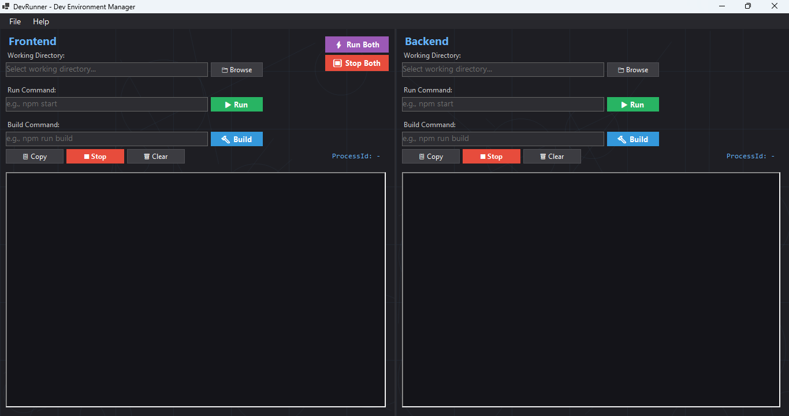

# DevRunner - Multi-Terminal Development Environment Manager

<p align="center">
  
  
  
  
</p>

A powerful Windows Forms application for managing multiple development terminals simultaneously. Perfect for running frontend, backend, CMS, and other services in a unified interface with customizable profiles and color schemes.



## ✨ Features

### 🎯 Core Functionality
- **Multi-Terminal Interface** - Manage unlimited terminals in a clean, stacked layout
- **Profile Management** - Create, save, and switch between different project configurations
- **Parallel Execution** - Run multiple environments simultaneously in separate PowerShell processes
- **Real-time Output** - Live terminal output with color-coded messages
- **Terminal Organization** - Rename, reorder (move up/down), and delete terminals on the fly
- **Collapsible Panels** - Expand/collapse individual terminals to focus on what matters

### 🎨 Modern UI & Theming
- **8 Color Schemes** - Choose from beautiful themes:
  - 🟢 Matrix Green - Classic hacker aesthetic
  - 🔵 Ocean Blue - Cool and calming
  - 🟡 Amber Terminal - Retro terminal vibes
  - 🟣 Purple Haze - Modern and vibrant
  - 🔴 Ruby Red - Bold and energetic
  - 💗 Cyberpunk Pink - Neon futuristic
  - ❄️ Arctic Frost - Clean and minimal
  - 🌅 Golden Sunset - Warm and inviting
- **Full Theme Application** - Colors affect headers, containers, buttons, and output areas
- **Dark Theme** - Easy on the eyes for long coding sessions
- **Responsive Design** - Adapts to window resizing

### ⚡ Smart Controls
- **Run All** - Start all terminals with one click
- **Stop All** - Terminate all processes instantly
- **Individual Control** - Run, build, stop, and clear each terminal independently
- **Auto-save** - All changes automatically persist to your profile
- **Copy Output** - Copy terminal output to clipboard

### 💾 Profile System
- **Multiple Profiles** - Create separate configurations for different projects
- **Save Profile** - Explicitly save current configuration
- **Save As New Profile** - Duplicate your current setup with a new name
- **New Profile** - Start fresh with an empty profile
- **Delete Profile** - Remove profiles you no longer need
- **Profile Selector** - Quick dropdown to switch between profiles
- **Auto-load** - Last used profile loads on startup

### 🔧 Terminal Management
- **Add Terminal** - Add new terminals to your current profile
- **Remove Terminal** - Delete terminals (prevents removing the last one)
- **Rename Terminal** - Click the pencil icon or terminal name to rename
- **Reorder Terminals** - Move terminals up/down with arrow buttons
- **Collapse/Expand** - Click +/− to toggle terminal visibility
- **Color Scheme per Terminal** - Each terminal can have its own theme

### 🔐 Process Control
- **Process Tree Termination** - Uses `taskkill /T /F` to kill entire process trees
- **Real-time Output** - See output as it happens
- **Working Directory** - Set custom working directory per terminal
- **Run Command** - Configure command to start your service/app
- **Build Command** - Configure command to build your project

## 🚀 Quick Start

### Prerequisites
- Windows OS
- .NET 8.0 SDK (for building from source)
- PowerShell

### Installation

#### Option 1: Download Release (Recommended)
1. Download the latest `DevRunner-win-x64.zip` from [Releases](https://github.com/Kariko762/DevRunner/releases)
2. Extract the ZIP file
3. Run `DevRunner.exe`

#### Option 2: Build from Source
```powershell
git clone https://github.com/Kariko762/DevRunner.git
cd DevRunner
dotnet build DevRunner.csproj
dotnet run --project DevRunner.csproj
```

## 📖 How to Use

### Profile Management

#### Creating a New Profile
1. Click **File → New Profile**
2. Enter a name for your profile
3. Add terminals using the **Add Terminal** button
4. Configure each terminal's settings

#### Saving Your Configuration
- **Auto-save**: Changes are automatically saved as you work
- **Manual Save**: Click **File → Save Profile** for peace of mind
- **Save As**: Click **File → Save As New Profile** to duplicate your current setup

#### Switching Profiles
- Use the profile dropdown in the menu bar to switch between profiles
- Your last active profile loads automatically on startup

### Terminal Configuration

#### Adding a Terminal
1. Click **➕ Add Terminal** in the toolbar
2. Enter the terminal name
3. Select a color scheme
4. Click OK

#### Configuring a Terminal
1. **Working Directory**: Click "Browse..." or type the path
2. **Run Command**: Enter the command to start your service (e.g., `npm start`, `dotnet run`)
3. **Build Command**: Enter the command to build your project (e.g., `npm run build`, `dotnet build`)

#### Managing Terminals
- **Rename**: Click the ✎ icon or click the terminal title
- **Move Up**: Click ▲ to move terminal higher
- **Move Down**: Click ▼ to move terminal lower
- **Delete**: Click ✕ to remove (can't delete the last terminal)
- **Collapse**: Click − to collapse, + to expand

### Running Your Environments

#### Run Individual Terminal
1. Click **▶ Run** button (green)
2. Process starts, terminal clears, output displays
3. Process ID shown in button when running

#### Run All Terminals
1. Click **▶ Run All** in the toolbar
2. All terminals start simultaneously

#### Stop Processes
- **Individual Stop**: Click **■ Stop** button in terminal
- **Stop All**: Click **⏹ Stop All** in toolbar

#### Build Projects
- Click **🔨 Build** button to run the build command
- Output displays in the terminal area

### Customizing Appearance

#### Change Terminal Color Scheme
1. Click the ✎ icon to edit the terminal
2. Select a different color scheme from the dropdown
3. Colors update immediately:
   - Header background
   - Title text color
   - Container background
   - Output area background and text
   - Button colors
   - Accent highlights

## 🎨 Color Schemes

DevRunner includes 8 beautiful color schemes that affect the entire terminal container:

| Scheme | Description | Perfect For |
|--------|-------------|-------------|
| 🟢 **Matrix Green** | Classic green-on-black terminal | Retro/hacker aesthetic |
| 🔵 **Ocean Blue** | Deep blue tones | Long coding sessions |
| 🟡 **Amber Terminal** | Warm amber glow | Vintage terminal feel |
| 🟣 **Purple Haze** | Vibrant purple accents | Modern, creative work |
| 🔴 **Ruby Red** | Bold red highlights | High energy coding |
| 💗 **Cyberpunk Pink** | Neon pink vibes | Futuristic projects |
| ❄️ **Arctic Frost** | Cool blue-white | Clean, minimal look |
| 🌅 **Golden Sunset** | Warm golden tones | Comfortable viewing |

## 💡 Tips & Tricks

- **Quick Profile Switch**: Use the dropdown in the menu bar to instantly switch between projects
- **Organize Terminals**: Order terminals by startup dependency (databases first, APIs second, frontends last)
- **Color Code by Type**: Use green for frontends, blue for backends, purple for databases
- **Collapse Unused**: Collapse terminals you don't need to monitor actively
- **Copy Output**: Use the "Copy" button to grab logs for debugging or sharing
- **Auto-save**: Don't worry about saving - every change is persisted automatically

## 🛠️ Building and Development

### VS Code
```powershell
# Build
Ctrl + Shift + B

# Run
.\bin\Debug\net8.0-windows\DevRunner.exe
```

### Command Line
```powershell
# Build
dotnet build DevRunner.csproj

# Run
dotnet run --project DevRunner.csproj

# Publish (self-contained)
dotnet publish -c Release -r win-x64 --self-contained true /p:PublishSingleFile=true -o .\publish\win-x64
```

## 📁 Project Structure

```
DevRunner/
├── AppSettings.cs              # Persistent settings & profile management
├── MainForm.cs                 # Main application form & orchestration
├── CollapsibleTerminalPanel.cs # Terminal container with header controls
├── TerminalPanel.cs            # Terminal interface & process management
├── TerminalConfig.cs           # Terminal configuration & color schemes
├── TerminalConfigDialog.cs     # Add/edit terminal dialog
├── InputDialog.cs              # Reusable input dialog
├── Profile.cs                  # Profile data model
├── Program.cs                  # Application entry point
├── DevRunner.csproj            # Project file
├── installer.iss               # Inno Setup installer script
├── assets/                     # Screenshots and images
└── README.md
```

## 🔧 Configuration File

Settings are stored at: `%APPDATA%\DevRunner\settings.json`

```json
{
  "CurrentProfileName": "My Project",
  "Profiles": [
    {
      "Name": "My Project",
      "Terminals": [
        {
          "Title": "Frontend",
          "Directory": "C:\\Projects\\MyApp\\frontend",
          "RunCommand": "npm start",
          "BuildCommand": "npm run build",
          "ColorScheme": "Ocean Blue"
        },
        {
          "Title": "Backend",
          "Directory": "C:\\Projects\\MyApp\\backend",
          "RunCommand": "dotnet run",
          "BuildCommand": "dotnet build",
          "ColorScheme": "Matrix Green"
        },
        {
          "Title": "Database",
          "Directory": "C:\\Projects\\MyApp",
          "RunCommand": "docker-compose up",
          "BuildCommand": "docker-compose build",
          "ColorScheme": "Purple Haze"
        }
      ]
    }
  ]
}
```

## 🐛 Troubleshooting

**Process won't stop?**
- DevRunner uses `taskkill /T /F` to forcefully terminate process trees
- Check Task Manager if processes persist
- Ensure you have permissions to terminate the process

**Terminal output not showing?**
- Ensure PowerShell is available in your PATH
- Check the working directory exists and is valid
- Verify the command syntax is correct

**Settings not saving?**
- Verify write permissions to `%APPDATA%\DevRunner\`
- Check the settings.json file isn't marked as read-only
- Ensure disk space is available

**Color scheme not applying?**
- Try restarting DevRunner
- Check that you clicked OK in the terminal edit dialog
- Verify the color scheme name exists

**Can't delete last terminal?**
- This is by design - each profile must have at least one terminal
- Create a new terminal first, then delete the old one

## 🚀 Use Cases

### Web Development
- Frontend (React/Vue/Angular)
- Backend API (Node.js/ASP.NET/.NET)
- Database (MongoDB/PostgreSQL via Docker)

### Microservices
- Multiple service instances
- Message queue (RabbitMQ/Kafka)
- API Gateway

### Full Stack Development
- Frontend dev server
- Backend API
- CMS/Admin panel
- Database migrations

### DevOps
- Local Kubernetes (minikube)
- Docker containers
- Build scripts
- Test runners

## 🤝 Contributing

Contributions are welcome! Please feel free to submit a Pull Request.

1. Fork the repository
2. Create your feature branch (`git checkout -b feature/AmazingFeature`)
3. Commit your changes (`git commit -m 'Add some AmazingFeature'`)
4. Push to the branch (`git push origin feature/AmazingFeature`)
5. Open a Pull Request

## 📝 License

MIT License - Feel free to use and modify!

## 🙏 Acknowledgments

Built with:
- .NET 8.0 Windows Forms
- PowerShell integration for process management
- Modern UI design principles
- JSON-based configuration

## 📧 Contact

- GitHub: [@Kariko762](https://github.com/Kariko762)
- Repository: [DevRunner](https://github.com/Kariko762/DevRunner)

---

<p align="center">Made with ❤️ for developers managing multiple development environments</p>
